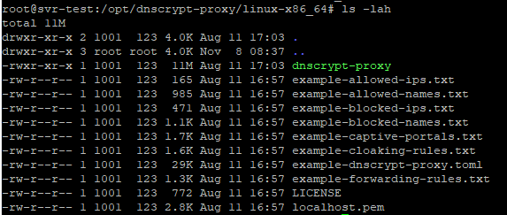
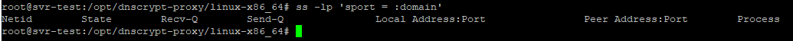
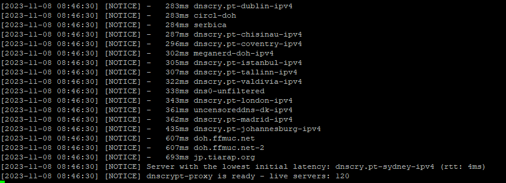
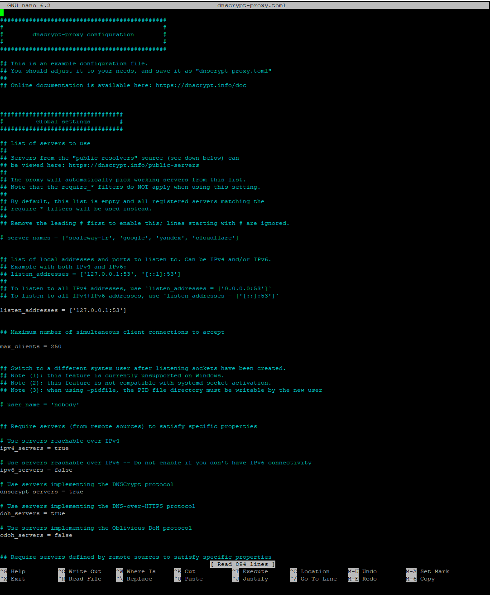
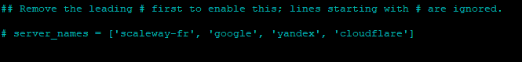
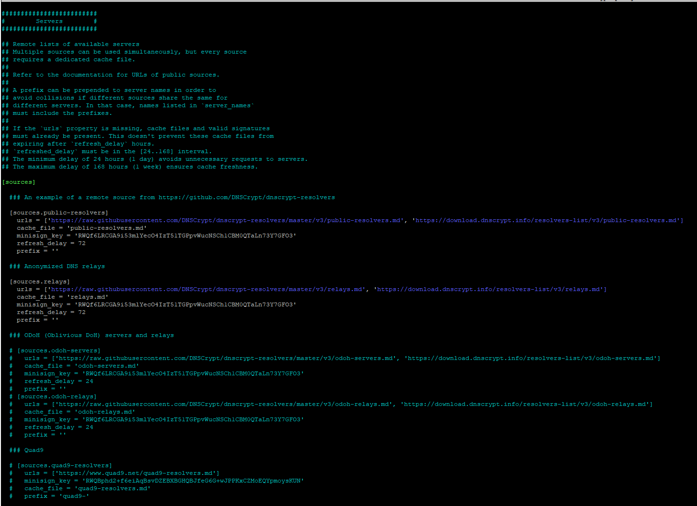
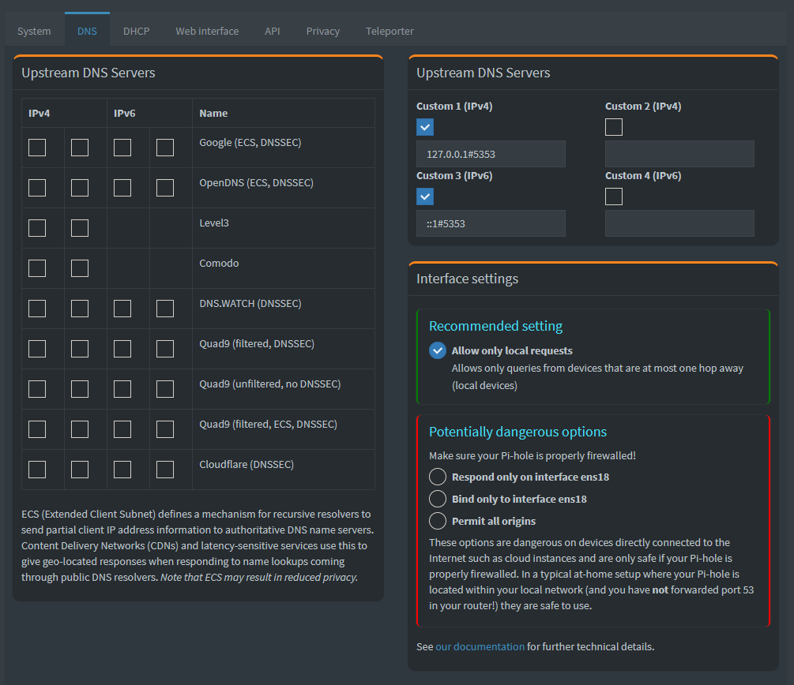

## Pi-hole with DNSCrypt-proxy to Quad9 on Ubuntu Server 22.04

### Preface

You may have found this as you are on a journey to improve your own digital privacy and I hope you find it useful.

The reason why I chose to do this instead of running pihole with unbound is that with unbound even though you are communicating directly in plain text unless you use DNS over HTTPS. But at that point you are deciding to pick between the superior caching features of Unbound or the protection that Quad9 provides with their malicious domain filters. I decided I would rather have that extra layer of protection with Quad9's filters and at the time of writing feel I can trust Quad9 with keeping my DNS queries private. As Quad9, Cloudflare, Google etc do not post their malicious domain filter lists, as it would alert the threat actors, there is no way to replicate this at home as far as I know. 

What these three combined will do:

- Block ads and trackers along with any other optional block lists you may add to Pi-hole
- Encrypt your DNS requests round trip between DNSCrypt-proxy and Quad9
- Certify DNS records with DNSSEC ensuring your DNS request data integrity
- Anonymise your DNS requests to everyone except Quad9
- Take advantage of Quad9's malicious domain block list
- Speed up your everyday browsing due to pihole caching


What they will NOT do:

- Hide your IP address / anonymise you from the sites you visit
- Act like a VPN
- Replace an antivirus
- Stop operating system level tracking / content scanning (e.g. Microsoft analytics)

### Guide Preface

I have tried to write this in a way that anyone who has used virtual machines and linux could follow.

The steps in the guide have been created on a Proxmox VM with Ubuntu Server 22.04.3 LTS, as such it will be all command line.

It is assumed you have installed Ubuntu Server on a VM or bare metal or you are able to follow the steps yourself with your chosen operating system.

It will make your life incredibly easier if you do this on a clean operating system with nothing else installed.

The first time I attempted this I had already installed Pihole and Docker (Docker not required) and it caused me so many issues it was easier to start from scratch.

At the bottom will be links to official documentation if that assists you.

---
### Installing DNSCrypt-proxy

#### Step 1

Elevate your console to root as you will be requiring it a LOT and doing so will bypass a lot of password entries.

`sudo -s`

---
#### Step 2 

Check what listening to port 53.

If there is a service running on port 53 it will cause a conflict and DNSCrypt will not run successfully.  This is why I mentioned not installing Pihole first.

Later on we will be disabling the operating system's DNS functionality and replacing it with DNSCrypt-proxy.

Type the following command to see what is currently listening to port 53:

`ss -lp 'sport = :domain'`

This may output something similar to:


This example shows that port 53 is currently in use and being listened to.  If you had pihole, unbound or some other DNS based service it should show up with the above command. You would then have to remove it at this point to proceed with the guide.

It is currently in use by the systemd-resolved process which is the inbuilt DNS process for resolving DNS requests.

---
#### Step 3

Download DNSCrypt-proxy install files.

Before we disable the systemd-resolved process we need to download the DNSCrypt install files, if we disable it before downloading we wont be able to resolve the address in the wget.

[DNSCrypt download link](https://github.com/jedisct1/dnscrypt-proxy/releases/latest)

The exact file will depend on your chosen operating system.  For this guide we will be using the following install file:

`dnscrypt-proxy-linux_x86_64-2.1.5.tar.gz`

*Please note that there may be a newer version than the one in this guide, ensure you are using the correct file name*
*If you are installing this on a raspberry pi or something arm based ensure you are using the ARM version etc. etc.*

Lets make the directory for DNSCrypt to live in and move there:

`mkdir /opt/dnscrypt-proxy/`

`cd /opt/dnscrypt-proxy/`

Now that we are in the directory where we want to install DNSCrypt we can download it.

`wget https://github.com/DNSCrypt/dnscrypt-proxy/releases/download/2.1.5/dnscrypt-proxy-linux_x86_64-2.1.5.tar.gz`

Checking the file is there:

`ls -lah`


Extracting the file:

`tar -xf dnscrypt-proxy-linux_x86_64-2.1.5.tar.gz`

Running `ls -lah` will reveal that there is a new folder there:


Lets change into that directory and see what is in there:

`cd linux-x86_64`

`ls -lah`


We can see there is an executable file along with some .txt and a .toml files. 



Lets use one of these to create our basic config which we will customise later on. 

`cp example-dnscrypt-proxy.toml dnscrypt-proxy.toml`

This newly created `dnscrypt-proxy.toml` is where all of the configuration lies for how DNSCrypt-proxy will run.

---
#### Step 4

Disabling systemd-resolved for testing.

To disable the inbuilt systemd-resolved process enter the following commands:

`systemctl stop systemd-resolved`

`systemctl disable systemd-resolved`

`systemctl status systemd-resolved`


Clear out of the status information with:

`ctrl + c`

Check that nothing is listening to port 53 anymore:

`ss -lp 'sport = :domain'`



Looks fine? Let's move to the next step.

---
#### Step 5

Initial configuration and test running.

Now that we have a basic base line let's do a test run of the `dnscrypt-proxy` program.

`./dnscrypt-proxy`

This may take a while as it will try to contact a large list of DNS resolvers. Let it run until it stops and we get a message that says it has worked.



Now we have checked that the system is primed and capable of running DNSCrypt-proxy without issues we can end the process with:

`ctrl + c`

Later on we will setup DNSCrypt to run as a system process but for now we will run the process every time we make a change to the config file as this is where I had a lot of issues. 

Lets open up the config file and start making some changes.

`nano dnscrypt-proxy.toml`



The initial changes will be around DNSSEC, IPv4 & IPv6 and the listen address (the address DNSCrypt-proxy will listen for incoming DNS requests).

If you only have IPv4 connectivity, then you can skip most of this. If you wish to enable IPv6 functionality this is where we make several of changes.

For IPv6 remove the comment marks on the following line:

`## listen_addresses = ['127.0.0.1:53', '[::1]:53']`

So it looks like

`listen_addresses = ['127.0.0.1:53', '[::1]:53']`

And add comment marks to the following line:

`listen_addresses = ['127.0.0.1:53']`

`## listen_addresses = ['127.0.0.1:53']`

We will leave these at port 53 for now. We will need to change these later on once we have Pihole installed.

Scroll down till you see this line:

```
# Use servers reachable over IPv6 -- Do not enable if you don't have IPv6 connectivity
ipv6_servers = false
```

Change false to true to enable IPv6:

```
# Use servers reachable over IPv6 -- Do not enable if you don't have IPv6 connectivity
ipv6_servers = true
```

Now to enable DNSSEC.

Enable this regardless of your IPv4 / IPv6 configuration.

Scroll down till you see:

```
## Require servers defined by remote sources to satisfy specific properties

# Server must support DNS security extensions (DNSSEC)
require_dnssec = false
```

Change to true:

```
## Require servers defined by remote sources to satisfy specific properties

# Server must support DNS security extensions (DNSSEC)
require_dnssec = true
```

At this point we will save our changes and do a test run.

To save your changes press `ctrl + o` and `enter` to save then `ctrl + x` to exit out of nano text editor.

Run DNSCrypt-proxy again.

`./dnscrypt-proxy`

We should get a similar result to the first time. Exit once it has successfully run. 

Once DNSCrypt has run successfully, exit out with `ctrl + c`.

---
#### Step 6

Setting up Quad9 DNS services.

We are now at the point where you can choose what exact service with Quad9 you wish to use. You could skip this part if you want to use the vast array of available DNS servers but I know nothing about these servers so I only wany my requests going to Quad9.

 The guide will be using their DNSCrypt encryption protocol, malicious domain filtering, ECS enabled. Quad9 have an exhaustive list of services available [here](https://www.quad9.net/quad9-resolvers.md). You can pick and choose exactly which services you wish to use if you don't want filtering or ECS disabled. If you wish to deviate from the configuration below note that the server name is in the commented out line, but it will require you to add a prefix of `quad9-` to it.  E.g. for disabled ECS find the line `## dnscrypt-ip4-filter-pri` and add quad9- and remove the comment marks so it looks like `quad9-dnscrypt-ip4-filter-pri` then you can paste this into the correct place in the `dnscrypt-proxy.toml` file.

I have ECS enabled as it will likely speed up requests and location based content delivery. If you want ultimate privacy you will want to disable the ECS functionality, though keep in mind it may slow down content delivery. This setting depends on your threat model. If you have facebook on your phone, that is a bigger privacy issue than ECS enabled so keep that in mind.

Let's update the config.

`nano dnscrypt-proxy.toml`

Uncomment out this line:

`# server_names = ['scaleway-fr', 'google', 'yandex', 'cloudflare']`



We want to change this line to the following:

`server_names = ['quad9-dnscrypt-ip4-filter-ecs-pri', 'quad9-dnscrypt-ip4-filter-ecs-alt', 'quad9-dnscrypt-ip6-filter-ecs-pri', 'quad9-dnscrypt-ip6-filter-ecs-alt']`


This is where you would choose to enable or disable filtering and ECS functionality. Replace the respective server names with the ones you wish to use.

Let's scroll far down now to the Servers section.

Here is where we will specify our server list for DNScrypt to use.

Here you can see the default settings.



This is where DNSCrypt was getting all of those public DNS resolvers we saw it running through before. We want to comment that section out and then enable the quad9 section.

*Keep in mind TOML is a space dependant language so you will want to make sure your line spacing is correct.*

Default settings:

```
[sources]

  ### An example of a remote source from https://github.com/DNSCrypt/dnscrypt-resolvers

  [sources.public-resolvers]
    urls = ['https://raw.githubusercontent.com/DNSCrypt/dnscrypt-resolvers/master/v3/public-resolvers.md', 'https://download.dnscrypt.info/resolvers-list/v3/public-resolvers.md']
    cache_file = 'public-resolvers.md'
    minisign_key = 'RWQf6LRCGA9i53mlYecO4IzT51TGPpvWucNSCh1CBM0QTaLn73Y7GFO3'
    refresh_delay = 72
    prefix = ''

  ### Anonymized DNS relays

  [sources.relays]
    urls = ['https://raw.githubusercontent.com/DNSCrypt/dnscrypt-resolvers/master/v3/relays.md', 'https://download.dnscrypt.info/resolvers-list/v3/relays.md']
    cache_file = 'relays.md'
    minisign_key = 'RWQf6LRCGA9i53mlYecO4IzT51TGPpvWucNSCh1CBM0QTaLn73Y7GFO3'
    refresh_delay = 72
    prefix = ''

  ### ODoH (Oblivious DoH) servers and relays

  # [sources.odoh-servers]
  #   urls = ['https://raw.githubusercontent.com/DNSCrypt/dnscrypt-resolvers/master/v3/odoh-servers.md', 'https://download.dnscrypt.info/resolvers-list/v3/odoh-servers.md']
  #   cache_file = 'odoh-servers.md'
  #   minisign_key = 'RWQf6LRCGA9i53mlYecO4IzT51TGPpvWucNSCh1CBM0QTaLn73Y7GFO3'
  #   refresh_delay = 24
  #   prefix = ''
  # [sources.odoh-relays]
  #   urls = ['https://raw.githubusercontent.com/DNSCrypt/dnscrypt-resolvers/master/v3/odoh-relays.md', 'https://download.dnscrypt.info/resolvers-list/v3/odoh-relays.md']
  #   cache_file = 'odoh-relays.md'
  #   minisign_key = 'RWQf6LRCGA9i53mlYecO4IzT51TGPpvWucNSCh1CBM0QTaLn73Y7GFO3'
  #   refresh_delay = 24
  #   prefix = ''

  ### Quad9

  # [sources.quad9-resolvers]
  #   urls = ['https://www.quad9.net/quad9-resolvers.md']
  #   minisign_key = 'RWQBphd2+f6eiAqBsvDZEBXBGHQBJfeG6G+wJPPKxCZMoEQYpmoysKUN'
  #   cache_file = 'quad9-resolvers.md'
  #   prefix = 'quad9-'

```

Updated settings for Quad9:

```
[sources]

  ### An example of a remote source from https://github.com/DNSCrypt/dnscrypt-resolvers

  # [sources.public-resolvers]
   #  urls = ['https://raw.githubusercontent.com/DNSCrypt/dnscrypt-resolvers/master/v3/public-resolvers.md', 'https://download.dnscrypt.info/resolvers-list/v3/public-resolvers.md']
   #  cache_file = 'public-resolvers.md'
   #  minisign_key = 'RWQf6LRCGA9i53mlYecO4IzT51TGPpvWucNSCh1CBM0QTaLn73Y7GFO3'
   #  refresh_delay = 72
   #  prefix = ''

  ### Anonymized DNS relays

  [sources.relays]
    urls = ['https://raw.githubusercontent.com/DNSCrypt/dnscrypt-resolvers/master/v3/relays.md', 'https://download.dnscrypt.info/resolvers-list/v3/relays.md']
    cache_file = 'relays.md'
    minisign_key = 'RWQf6LRCGA9i53mlYecO4IzT51TGPpvWucNSCh1CBM0QTaLn73Y7GFO3'
    refresh_delay = 72
    prefix = ''

  ### ODoH (Oblivious DoH) servers and relays

  # [sources.odoh-servers]
  #   urls = ['https://raw.githubusercontent.com/DNSCrypt/dnscrypt-resolvers/master/v3/odoh-servers.md', 'https://download.dnscrypt.info/resolvers-list/v3/odoh-servers.md']
  #   cache_file = 'odoh-servers.md'
  #   minisign_key = 'RWQf6LRCGA9i53mlYecO4IzT51TGPpvWucNSCh1CBM0QTaLn73Y7GFO3'
  #   refresh_delay = 24
  #   prefix = ''
  # [sources.odoh-relays]
  #   urls = ['https://raw.githubusercontent.com/DNSCrypt/dnscrypt-resolvers/master/v3/odoh-relays.md', 'https://download.dnscrypt.info/resolvers-list/v3/odoh-relays.md']
  #   cache_file = 'odoh-relays.md'
  #   minisign_key = 'RWQf6LRCGA9i53mlYecO4IzT51TGPpvWucNSCh1CBM0QTaLn73Y7GFO3'
  #   refresh_delay = 24
  #   prefix = ''

  ### Quad9

  [sources.quad9-resolvers]
   urls = ['https://www.quad9.net/quad9-resolvers.md']
   minisign_key = 'RWQBphd2+f6eiAqBsvDZEBXBGHQBJfeG6G+wJPPKxCZMoEQYpmoysKUN'
   cache_file = 'quad9-resolvers.md'
   prefix = 'quad9-'

```

We can now save those changes with `ctrl + o` and `enter` then exit out with `ctrl + x`.

Let's give it a test run.

`./dnscrypt-proxy`

If you have followed the guide exactly it should work.

If you have some errors triple check your config file for typo's, spacing errors or something along those lines.

Once you have it working close out the process with `ctrl + c`.

Before we move on we need to make one last change in preparation for Pihole.

We need to change the local host listening port for Pihole to forward the DSN requests to.

Let's update the config.

`nano dnscrypt-proxy.toml`

Change the listen address config from:

`listen_addresses = ['127.0.0.1:53', '[::1]:53']`

To:

`listen_addresses = ['127.0.0.1:5353', '[::1]:5353']`

We can now save those changes with `ctrl + o` and `enter` then exit out with `ctrl + x`.

---
#### Step 7

Installing Pihole.

We need to reenable the systemd-resolved process temporarily to run the pihole install.

`systemctl enable systemd-resolved`

`systemctl start systemd-resolved`

`systemctl status systemd-resolved`

Install pihole:

`curl -sSL https://install.pi-hole.net | bash`

Follow through the pihole installation for which I wont document here as there exists a million others already.  

*Make sure to set a manually assigned IP address to the system!*

Once pihole is installed we can change the default generated password with this command:

`pihole -a -p`

Once you have changed the password it's time to put it all together.

---
#### Step 8

Installing DNSCrypt-proxy as a system service.

We need to disable the systemd-resolved process once and for all.

`systemctl stop systemd-resolved`

`systemctl disable systemd-resolved`

`systemctl status systemd-resolved`

Now to install the DNSCrypt-proxy as a service.

`./dnscrypt-proxy -service install`

`service dnscrypt-proxy start`

`service dnscrypt-proxy status`

Now DNSCrypt-proxy will run on system boot and won't require an active console session.

---
#### Step 9

Linking it together.

We need to log into the admin console of pihole through your browser and set forward the DNS requests to DNSCrypt.

In settings go to DNS.

Uncheck all upstream DNS options and set the custom Upstream DNS settings as shown:

IPv4:

`127.0.0.1#5353`

IPv6:

`::1#5353`



Scroll to the bottom and click Save.

There may be an error displayed on the Pihole Admin page, that is ok.

We will go back to our terminal and clear that.

On the server run the following commands:

`pihole -up`

`pihole -g`

These commands will clear any errors.

Now the path is complete!

The final step is to set your network to forward all DNS requests to the Pihole / DNSCrypt machine. This can be done in what ever router internet connection settings you have. I cannot help you there I am afraid. 

That should be it. It should be working now.

---
#### Step 10

Ensuring your requests are actually encrypted!!!

You can test this by issuing the following command in the server:

`dig +short txt proto.on.quad9.net`

You should get one of the following responses:

```
    do53-udp (53/UDP - Plaintext)
    do53-tcp (53/TCP - Plaintext)
    doh (443/TCP - DNS over HTTPS)
    dot (853/TCP - DNS over TLS)
    dnscrypt-udp (UDP - DNSCrypt)
    dnscrypt-tcp (TCP - DNSCrypt)

```


---
#### Congratulations!

Now your DNS requests are all encrypted!

---
### Helpful links

https://docs.quad9.net/FAQs/#protocol-test-confirm-on-which-protocol-quad9-received-your-query

https://github.com/DNSCrypt/dnscrypt-proxy/releases/

https://dnscrypt.info/public-servers/

https://github.com/DNSCrypt/dnscrypt-proxy/wiki/Installation-linux
